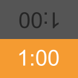

Moved to https://github.com/NotWoods/games/tree/main/gameclock



# GameClock

Time your chess games, jenga games, and other board games.

I built this PWA for
[Chess Clock Jenga](https://www.youtube.com/watch?v=YN_F9bNuF0I), because I
couldn't find any suitable web apps. The design is based on
[another, now unavailable, PWA](https://appsco.pe/app/gameclock) and the
[Chess Clock Android app](https://play.google.com/store/apps/details?id=com.chess.clock&hl=en).

## Developing

Install dependencies:

```shell
npm install
```

Once the modules are installed, just run a web server. Thanks to
[Snowpack](https://www.snowpack.dev), no build step is needed to test the
program.

To generate the Service Worker, run `npm run sw`.

## Licensing

This project is available under the MIT License.
